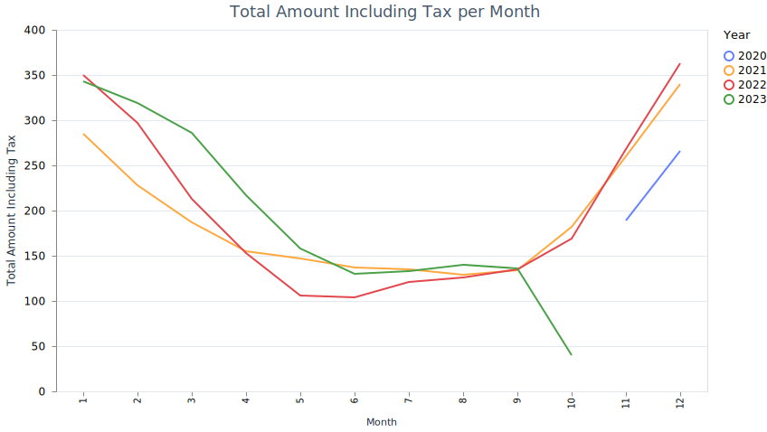
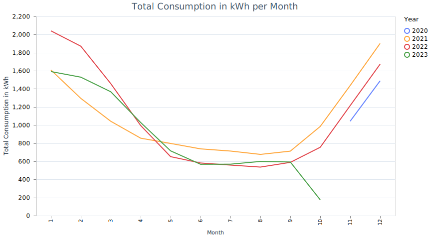

# Energy Consumption Dashboard with Livebook

## Overview

This project aims to visualize household electricity consumption data provided by Engie. It allows users to compare their current energy usage with data from the past year in a simplified manner using Livebook. To get started, you'll need to fetch some data from Engie.

## Technologies Used

- Elixir
- Livebook

## Data Collection

You need to manually collect your consumption data from Engie's website:

1. Navigate to [Engie's Consumption Page](https://particuliers.engie.fr/espace-client/consommations.html).
2. Open Developer Tools (`F12` or `Right-click > Inspect`).
3. Navigate to the Network tab.
4. Look for the request named "consoMoisAnnee" and click on it.
5. Go to the Response sub-tab.
6. Copy-paste the content into a file named `conso.json`.
7. Drag and drop the `conso.json` file into the designated box in Livebook.

## Installation

1. Install [Livebook](https://github.com/livebook-dev/livebook#installation).
2. Clone this repository:
   ```
   git clone https://github.com/yannvery/engie_visualisator.git
   ```
3. Open the file [`engie_visualisator.livemd`](https://github.com/yannvery/engie_visualisator/blob/main/engie_visualisator.livemd) with Livebook.

## Usage

Run Livebook and evaluate all cells to the `engie_visualisator.livemd` to visualize the data.




## License

This project is licensed under the GNU General Public License v3.0. See the [LICENSE](LICENSE.md) file for details.
